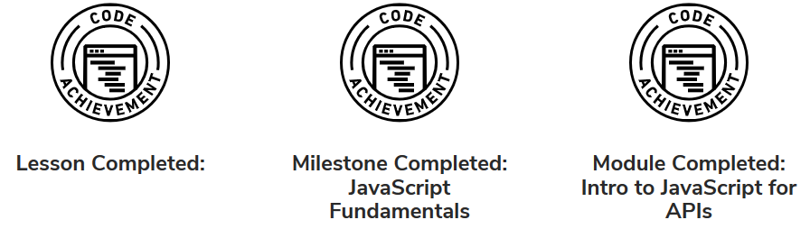

# Session 5 WEB Tuts

Working through the **Codecademy HTML** tutorials and finding they will be of use for our in-class 
group project the Chip Comparer app. therefore this should take some of the thinking away from 
the HTML and CSS coding so I can concentrate on how to work with GitHub and work within the team.

It's has been a few days since I wrote the 1st mini paragraph and I still struggle to understand 
the workings of git. I have tapped into my group who have been very supportive even though I 
remain a little frazzled on the pulling, pushing, committing and deleting and whatever else.

More time has passed and I still have my issues with the understanding of GitHub, every now and 
then I run into problems that I can not resolve. Git is a thorn in the bonnet at this point of time.

Codecademy is great! offering an abundance of highly recommended tutorials I have since finished 
the Introduction to HTML, started the Learn CSS course and decided that with that mini streak I 
would begin the Introduction To JavaScript course.

Which has proved to be very educational, to date this Codecademy site our tutor introduced to us 
is an absolute asset to our learning and a must in the toolbox.

