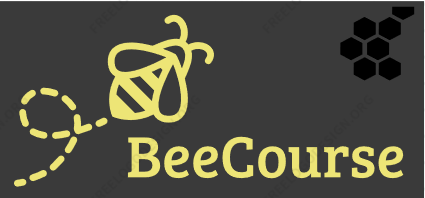

#  Week 5 Session 10

The class was from 9 - 3pm today we worked through some JavaScript and project work. We are all 
a little stress like the normal when it comes to having an assignment or project that needs to 
be handed in tonight.

Ali has provided us with all the resources we need to complete our work, therefore, the rest is 
up to us to give Ali wants he expects from us.

Today is a day I hope to focus more on completing something anything, there is quite a lot to cover.
What needs to be worked over in my spare time:

* Codecademy Introduction to JavaScript 66% complete (30 hrs)
* Codecademy learn CSS 22% complete (15 hrs)
* Codecademy Learn Express 16% complete (4 hrs)
* Codecademy Learn ReactJS: Part 1 2% complete (7 hrs)
* freeCodeCamp Basic JavaScript ALOT 13/107 steps completed
* freeCodeCamp ES6 0% complete
* 4 journal entries to write

What needs to be started and completed tonight and handed in:

* Work on Milestone 1 Report

What needs to be started and completed by Monday:

* first cut of HTML and components and routes implemented

On that note I need to get on with my report starting with wireframes and mockups I will be using
Marvelapps and Wireframe mockup pro.

