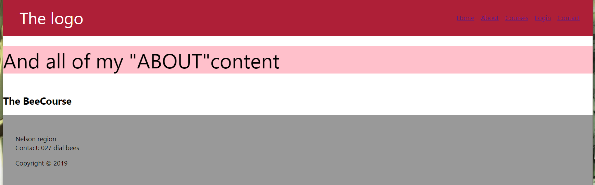

#  Week 5 Session 9

Today in class Ali the tutor took us through building an app from the ground up.
This came about with the student needs within the class - a good percentage in the class are struggling 
to glue together the learning to produce a website.
Ali also had us install "faker" giving us access to free online material we can implement into our own projects.

**Codecademy:**
Still working through JavaScript tutorial 66% finished. Finding it very good only catch is that tutorials take 
some time to work through. Currently spending 2 hours a day on tutorials and hoping something retains.

**Routes:**
Jase and I went through routes prior to class, we have our webpages linked to the appropriate pages just unsure 
whether Ali would like the routes done the way we have executed them.

During class, Ali gave us a link to take us through routing and it just so happens we were on the right track 
for now - yay.

**Project:**
To date, I am working on the navbar/CSS and learning about flexbox which is a small challenge as much as my 
tutor Ali does not want to hear the word bootstrap lol that is what I am more familiar with when it comes to 
building a navbar the old drag n drop.

The fun part of building components to populate the pages of my website is the next milestone, followed by 
writing up the report which has become more indepth than I had anticipated.
