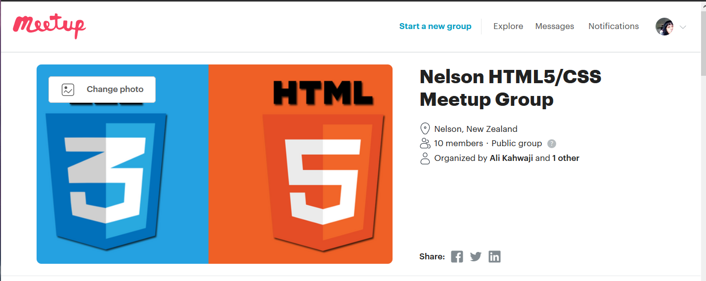

# Week 6 Session 11

This week is non-contact week, we have no classes but! Ali offered his pressence if anyone wanted
to come along today to learn JavaScipt. To start Ali had us join a Meetup group app where the class 
can get together and group code and just hang out.
The next meeting will be at the Speights Alehouse on the 27th of September, this will be fun.

In class today Ali had us on freeCodeCamp an environment where we can learn to code for free. 
Being not so flash at JavaScript it has been recommended I start with the Basic JavaScript exercises. 
JavaScipt is going to be needed more as we work through our projects.

Ali drops that we will be preparing for Redux which involves JavaScript. A few people in the
class are new to JavaScript like me which is a tad unfortunate and not so good that Ali our
tutor has been led to believe we were all familiar with JavaScript. No worries we will all get
there in the end.

### Website ###

Only just realized I have yet to populate my About page and work on some more components but other
then that pretty much up to scratch.

### What I learned in class ###

Algorithms are puzzling and I am looking forward to more brain exercises, nothing like feeling stuck
on a problem for ages but! Oh so satisfying when you get it.
Basic JavaScript tutorial might be a little too easy and if I was not so hung up on finishing
something I have started I would move on and skip a number of exercises. Went over how to comment out
code, create variables and some basic maths the tricky part is staying on task and do the solution
without thinking about my SDV lvl 6 paper that needs to be handed in in a few days.