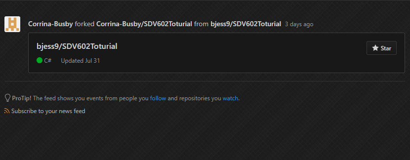
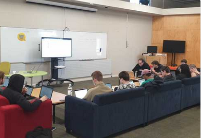

# Week 7 Session 13

### Thunder Talks and Open Source Contributions

Today was fun and very relaxing considering we have presentations looming over our heads.
Class is held in the Kowhai lounge which  is nice n comfy for a change. We kick off with github contributions to open source projects. Takes me an hour to figure out what we are  doing to clone and then decide what to write. Initially thought we were fixing other people code to which I would be more likely to make  more errors - but it was not like that, Ali's teaching was in becoming familliar and building confidence in contributing to open source projects.  All that was expected was a compliment or a hello nothing major just some practice to get us on the github bandwagon and our fear of  contributing on others github repositories.
  
I thought I would comment on a friends open source project - but when i went to push the commit I received an error and spent a bit of time  trying to fix it. My friend sent me a message later that evening with a snap shot of the request I had made to his repo, so in the end I guess  it all went through, success.
 
 

 
 
The presentations were great - every talk was different, informative and well presented. 
 
Followed yummy coffee courtesy of Ali.
 
  
The following is an image of the cowboy coders chillaxin in the Kowhai lounge.
 
 

### Home Work ###

The list is long but basically revisiting lessons to gain understanding of the flow of my web project.

* freeCodeCamp tutorials the mission is to complete all 107 short exercises in Basic JavaScript 
* codecademy is also on the agenda to finish the JavaScript tutorials, currently 72% complete. 
* revisit my web project and populate the 'About' page